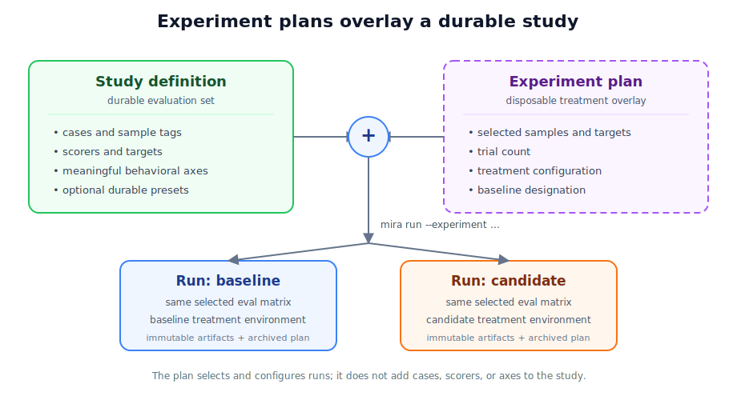

# Experiment plans

Experiment plans let you compare short-lived treatments without adding temporary axes, presets, or candidate names to a durable study.

Use them for prompt candidates, tool descriptions, binaries, dependency upgrades, search strategies, feature flags, and other A/B investigations. Mira treats each candidate as a generic **treatment**; the study keeps ownership of cases and scorers.



The experiment coexists with the main eval set as an overlay: it selects a slice of the study and supplies run-level treatment configuration, but it does not create a second eval set or mutate the study catalog.

## Define an experiment

Create a TOML file outside the study:

```toml
# prompt-experiment.toml
study = "harness_basic"
launcher = "harness-basic"
preset = "prompt-regression"

[slice]
samples = ["approval", "instruction-precedence", "add-fn"]
targets = ["openai/gpt-5.5"]
trials = 3

[[treatments]]
name = "baseline"
env.HARNESS_BASIC_YOLOP_BIN = "./bin/current/yolop"

[[treatments]]
name = "minimal-prompt"
env.HARNESS_BASIC_YOLOP_BIN = "./bin/minimal/yolop"

[compare]
group_by = "treatment"
baseline = "baseline"
```

Run it directly through the Mira CLI:

```bash
mira run --experiment prompt-experiment.toml
```

`--experiment` is a `mira run` mode, so no wrapper script or separate service is required. It cannot be combined with direct run-selection flags such as `--preset`, `--sample`, `--target`, or `--trials`; put those values in the plan instead.

Mira launches one ordinary run per treatment. All treatments share an experiment ID, while each run records its treatment name and whether it is the baseline.

## Compose with a study

An experiment plan overlays existing study configuration:

1. `launcher` selects the study process, using the same launcher lookup as `mira run --launcher`.
2. `preset` optionally applies durable study defaults.
3. `slice.samples` and `slice.targets` narrow the selected work.
4. `slice.trials` overrides the trial count.
5. Each `treatments[].env` map configures one treatment's study process.

The study reported by the launcher must match `study` in the plan. Mira rejects duplicate treatment names, unknown baselines, unsupported comparison grouping, and a trial count of zero before starting runs.

Treatment environment values are opaque to Mira. This keeps experiment plans provider- and domain-independent: Mira does not need concepts such as prompt profiles or candidate binaries.

## Use manifest-relative paths

Environment values beginning with `./` or `../` are resolved relative to the experiment file, not the shell's working directory:

```toml
[[treatments]]
name = "candidate"
env.MY_BINARY = "./build/candidate"
```

Other values pass through unchanged.

## Reproduce and compare saved runs

Every treatment run archives:

- `experiment-source.toml` — the exact plan supplied to Mira;
- `experiment.toml` — the resolved plan, including manifest-relative paths;
- run environment labels for `experiment_id`, `treatment`, and `experiment_baseline`.

The normal run artifacts still capture study version, effective run configuration, results, and report data. When environment capture is enabled—the default—they also record Git and host context plus the experiment labels. The archived manifests remain available regardless of that setting.

Use Mira's normal saved-run reporting and comparison workflows on those runs. The experiment metadata is a run-level comparison dimension; it does not become a permanent study axis.

## Security note

Do not place secrets directly in an experiment plan. Mira archives both the source and resolved manifests with every treatment run. Pass secrets through the parent process environment or another secret-management mechanism instead.

## Current scope

Experiment plans designate and record a baseline, but Mira does not yet evaluate automated comparison gates. Mira also does not hash files or binaries named in treatment configuration; archive those separately when byte-for-byte input provenance is required.

For the complete manifest field reference, see [Experiment plan reference](../experiments.md).

## See also

- [Getting started](../getting-started.md)
- [Experiment plan reference](../experiments.md)
- [Authoring studies](../authoring.md)
- [How Mira works](../how-it-works.md)

---

*Introduced in v0.4.0.*
