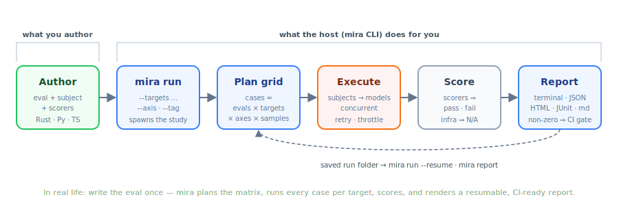

# Getting started

This walks you from zero to a passing eval run. The whole flow is one loop: you
author an eval once, then `mira` plans the matrix, runs every case against each
target, scores the transcripts, and renders a CI-ready report you can resume.

<p align="center">

</p>

## 1. Install

The framework is a library (`mira-eval`, imported as `mira`); the runner is a
binary (`mira-cli`, installed as `mira`).

```bash
cargo add mira-eval
brew install everruns/tap/mira      # or: cargo install mira-cli
cargo binstall mira-cli             # prebuilt binary, no compile (installs `mira`)
```

## 2. Write an eval study

An eval **study** is just a program that defines evals and calls
`mira::Study::registered().serve()`. The lightest way to write one is a **single
file** — no crate, no `Cargo.toml` — using cargo-script frontmatter for its
deps. Save this as `study.rs`:

```rust
#!/usr/bin/env -S cargo +nightly -Zscript
---
[package]
edition = "2024"

[dependencies]
mira-eval = "0.3"
tokio = { version = "1", features = ["macros", "rt-multi-thread"] }
---
use mira::scorer::{contains, succeeded, tool_called};
use mira::subject::subject_fn;
use mira::{eval, Eval, Target, Sample, Transcript};

#[eval]
fn capital() -> Eval {
    Eval::new("capital")
        .describe("Knows world capitals")
        .add_sample(Sample::new("france", "What is the capital of France?").expected("Paris"))
        .add_sample(Sample::new("japan", "What is the capital of Japan?").expected("Tokyo"))
        .subject(subject_fn(|sample, cx| async move {
            // Replace this with a real model call keyed on `cx.target`.
            let answer = match sample.id.as_str() {
                "france" => "The capital of France is Paris.",
                _ => "The capital of Japan is Tokyo.",
            };
            let _ = cx; // model is available as cx.target
            Transcript::response(answer)
        }))
        .scorer(succeeded())
        .scorer(mira::scorer::matches_expected()) // compares to Sample.expected
        .targets([Target::sim(), Target::anthropic("claude-opus-4-8")])
        .build()
}

#[tokio::main]
async fn main() -> std::io::Result<()> {
    mira::Study::registered().serve().await
}
```

`cargo -Zscript` is nightly-only, so the host **shims it onto stable**: it reads
the frontmatter, materializes a throwaway crate, and builds it — no nightly
toolchain required. (Set `MIRA_SCRIPT_NATIVE=1` to run it natively once
cargo-script stabilizes.) Prefer a real crate? The same `#[eval]`/`main` works as
a `[[bin]]` or an `examples/*.rs` target — run it with `--bin NAME` /
`--example NAME` instead of `--script`.

## 3. Run it

```bash
mira list --script study.rs
```

```text
capital — Knows world capitals  (max_turns=12)
  samples: france, japan
  scorers: succeeded, matches_expected
  targets:  sim, anthropic/claude-opus-4-8 (unavailable)
```

The cloud case is **unavailable** because `ANTHROPIC_API_KEY` isn't set — it will
be skipped, not failed. Run the matrix:

```bash
mira run --script study.rs
```

```text
── matrix (passed/ran) ──
  eval         sim  anthropic/claude-opus-4-8
  capital      2/2                          —

2 passed / 2 scored (0 failed, 0 n/a, 2 skipped)
```

A case that *does* run but hits **infrastructure** trouble (out of budget,
rate-limited, a provider outage) is scored **N/A** rather than failed — it's not
the model's fault. N/A cases are excluded from the pass-rate and retried; see
[Infrastructure errors vs. failures](authoring.md#infrastructure-errors-vs-failures).

Set `ANTHROPIC_API_KEY` and the cloud column lights up too.

## 4. Select, report, resume

```bash
mira run --script study.rs france                 # substring grep on the case key
mira run --script study.rs --samples 'geo/*'      # glob on sample ids
mira run --script study.rs --tag smoke            # by sample tag
mira run --script study.rs --targets 'anthropic/*' # glob on target labels
mira run --script study.rs --format junit --out results.xml   # CI artifact
mira run --script study.rs --format html  --out report.html   # self-contained viewer
mira run --script study.rs --format csv   --out runs.csv      # long-format, for analysis
mira run --script study.rs --format jsonl --out runs.jsonl    # one RunResult per line
mira run --script study.rs                        # saves a run folder by default
mira run --script study.rs --dry-run              # ephemeral; don't save a run folder
mira run --script study.rs --resume <run_id>      # reopen a run; run only the missing cases
mira report <run_id>                               # re-render a saved run's reports
```

Tired of retyping `--script study.rs`? Save it as a **named launcher** in
`mira.toml` and select it with `--launcher`, or set a `default_launcher` so a
bare `mira run` just works:

```toml
[launchers.evals]
script = "study.rs"    # or bin = "…" / example = "…" / cmd = "python study.py"

default_launcher = "evals"
```

```bash
mira run               # uses default_launcher
mira run --launcher evals
```

Explicit launch flags still override the named launcher (handy for a one-off
`--bin other`).

The exit code is non-zero if any case failed, so `mira ... run` drops straight
into CI. The HTML report is a single dependency-free file (summary, matrix, and
per-case scores/usage/timing) you can open straight from a CI artifact.

On an interactive terminal a live progress bar shows `done/total`, elapsed time,
and an ETA as cases complete; it's hidden under CI/non-TTY so it never pollutes
logs.

Every `mira run` (and `mira score`) **saves a run folder by default** under the
results dir, unless you pass `--dry-run`. Each run lands in
`<results_dir>/<run_id>/`:

- `meta.json` — run identity: id, study, start/finish timestamps, summary, and
  the **environment** the run came from (see below). Written as a header when
  the run starts, then rewritten at the end with the finish time and summary.
- `report.json` — the canonical machine-readable record (summary + per case),
- `report.html` — the self-contained transcript viewer,
- `cases/<encoded-key>/result.json` — one finished case
  (`eval/sample@target[…]#trial`), written atomically as that case completes.

A fresh `mira run` mints a new id and reuses nothing — no silent reuse of stale
results. To continue a run, name it explicitly: `--resume <run_id>` reopens that
run folder, skips the cases already recorded under `cases/`, and runs only
what's missing.

The results dir is `[results].dir` from the nearest `mira.toml`, else
`./results`. A `mira.toml` at the repo root sets the default for everyone:

```toml
[results]
dir = "./results"   # where saved run folders go
```

`mira report <run_id>` re-renders a saved run's reports from its stored
`cases/*/result.json` — no study process is spawned, nothing is re-executed.

### Environment metadata

Every saved run records the context it was produced in, so a result can be
interpreted and compared later — which commit, which box, which host version.
`meta.json` carries an `environment` block:

- **git** — `HEAD` commit, branch, and a `dirty` flag for uncommitted edits,
- **box** — `os`, `arch`, `hostname`, `cpus`, `mem_total_mib`,
- **mira_version** — the host binary that produced the run,
- **labels** — auto-detected CI context (`ci.*`) plus anything you configure.

Capture is **on by default** and best-effort (anything it can't determine is
omitted; it never fails a run). Control it under `[environment]`:

```toml
[environment]
enabled = true            # set false to record no environment block

[environment.labels]      # static labels stamped on every run, for later filtering
team = "search"
region = "us-east-1"
```

Configured labels override auto-detected ones on a key collision.

## 5. Publish to everruns (optional)

Every run is saved locally, but you can also publish it to an
[everruns](https://everruns.com) instance, which hosts and visualizes results it
did not execute — useful for sharing, comparing runs, and onboarding people who
shouldn't have to run the eval themselves.

```bash
everruns login                 # one-time: mira reuses these credentials
mira run --script study.rs --publish everruns
mira publish <run_id>          # or publish a previously saved run
```

Credentials resolve from `--everruns-*` flags, then
`EVERRUNS_API_KEY`/`EVERRUNS_API_URL`/`EVERRUNS_ORG_ID`, then the everruns CLI's
own `~/.config/everruns/credentials.json`. One run becomes one everruns run group
(one EvalRun per eval), idempotent on the run id. See `mira-publish-everruns`.

## 6. Check your setup (`mira doctor`)

When something misbehaves — a preset that selects nothing, a launcher that
won't start, runs that look torn — `mira doctor` diagnoses the whole setup in
one pass:

- **Config** (`mira.toml`): parse errors, unknown or misspelled keys (with a
  "did you mean" suggestion), launcher mistakes (no launch mode, conflicting
  modes, missing scripts), presets and timeouts that can't work.
- **Study**: launches your study exactly like `run` would, then lints what it
  advertises — duplicate sample ids / target labels / axis values (these
  collide case keys, so results silently overwrite), empty datasets or
  matrices, unavailable targets — and cross-checks the config's presets and
  `[targets.LABEL]` sections against the real listing.
- **Saved runs** (the results dir): interrupted runs (with the `--resume` id to
  finish them), invalid case results, leftover temp files from interrupted
  writes, finished runs missing their reports.

```bash
mira doctor          # report findings; exits non-zero if any error
mira doctor --fix    # also apply the safe fixes: remove leftover temp files,
                     # re-render a finished run's missing report.json/report.html
```

Warnings never fail doctor; errors exit non-zero, so it can gate CI.

## Next steps

- [Authoring evals](authoring.md) — datasets, the matrix, extra axes, metadata.
- [Scorers](scorers.md) — the built-ins (incl. metric budgets) and writing your own.
- [Metrics](metrics.md) — tokens/cost/latency, and how to add a custom metric.
- [Subjects](subjects.md) — in-process, CLI/polyglot, and runtime sessions.
- [Extensibility](extensibility.md) — the map of every seam: custom subjects,
  scorers, metrics, trajectories, and protocol-level extension.
- [The protocol](protocol.md) — what flows over the wire, and its versioning.
