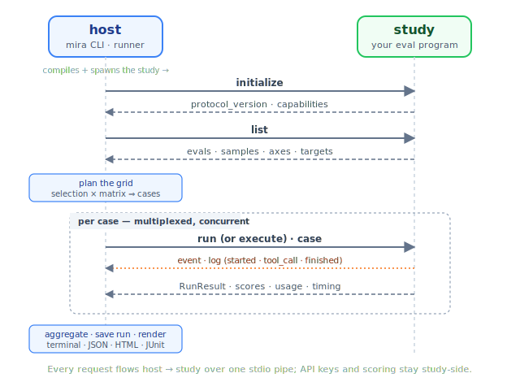

# How Mira works

A tour of the model behind Mira — the moving parts, how they fit together, and
why the framework is shaped the way it is. For a hands-on intro, start with
[getting started](getting-started.md); for the exact wire format, see the
[protocol reference](protocol.md).

## The core model

```text
Eval = Dataset(Sample…) + Subject + [Scorer…]  ×  model matrix × axes
```

- **`Sample`** — one dataset row: input turns, an optional `target`, seeded
  `files`, `tags`, and `metadata`. Language-agnostic JSON; write it inline in
  Rust for small evals, or load `Dataset::{jsonl,json}` for larger sets.
- **`Subject`** — the thing under evaluation, one adapter per *shape*:
  - `subject_fn(closure)` — the in-process path.
  - `CliSubject` — an external binary; the **polyglot / other-language** path.
    It reads stdout, an ATIF trajectory file (recommended for tool-using
    agents), or a canonical JSONL transcript, and can seed/capture files.
  - `mira_everruns::RuntimeSubject` — drives a live `everruns-runtime` session.
- **`Transcript`** — the normalized result of a run: final response,
  iteration/tool counts, token + cost usage, tool names, captured files, the
  structured ATIF `trajectory` (the **primary** trajectory contract: tool
  arguments, correlated observations, per-step metrics), and any error. Every
  subject produces the same shape, so scoring and reporting are shared. The raw
  `events` channel is advanced-only, for debugging and data the trajectory
  doesn't model.
- **`Scorer`** — `score(&Sample, &Transcript) -> Score` (a `value` in `0..1`, a
  `pass`, and a `reason`). Deterministic built-ins, operational budgets, an
  arbitrary-closure escape hatch, and `model_graded` LLM-as-judge — one open
  vocabulary, freely composed.
- **`Target`** — one matrix case. It is **provider-agnostic**: a `(label,
  provider, model, available, metadata)` tuple with no API keys and no SDK
  types. Subjects interpret it.

These entities nest — a study holds evals, an eval composes the pieces above, and
the host expands the matrix into the cases (and trials) that actually run. The
[entity-hierarchy diagram](authoring.md#the-entity-hierarchy) in the authoring
guide draws the full picture.

## Two processes, one protocol

The single most important design decision: eval *definitions* and the *runner*
live on opposite sides of a process boundary, talking newline-delimited JSON
over stdio (MCP-style).

- **study** — *your* eval program. It defines evals and calls
  `Study::registered().serve()` (or `Study::new(…).serve()`). It owns subjects
  and scoring and knows nothing about selection, matrices, saved runs, or
  rendering. **Provider API keys live only here and never cross the wire.**
- **host** — the `mira` CLI. It compiles and spawns the study, enumerates evals
  (`initialize` + `list`), plans the run (selection × matrix), drives execution
  (`run`), then aggregates, saves the run, and renders.

Three core methods (`initialize`, `list`, `run`) plus fire-and-forget
`event`/`log` notifications and optional capability-gated extensions
(`execute`/`score`, and `list_samples` to page large datasets). This boundary is
the natural seam for **polyglot studies** — any program in any language that
speaks the protocol is a valid study.

The protocol is versioned: `initialize` advertises a `MAJOR.MINOR`
`protocol_version` and a `capabilities` list. A major bump is breaking; a minor
bump is additive. Every payload tolerates unknown fields, so a newer study and
an older host interoperate.

A single run reads as a conversation over one pipe — the host handshakes,
enumerates, plans the grid, then drives a `run` (or `execute`) per case while the
study streams `event`/`log` notifications back:

<p align="center">

</p>

## The matrix

The **target** is the first-class axis — the configured thing under evaluation.
For an LLM eval a `Target` *is* a model; for an agent eval it is a harness
(`Target::cli("yolop")`), optionally wrapping a model. The runner expands `evals
× targets × axes × samples` into independently-addressable cases. A missing API
key marks a case `available: false`, so it is **skipped, not failed** — a fresh
run is green offline.

**Arbitrary axes** beyond the target are first-class too: `Eval::axis(name,
values)` adds a discrete axis (reasoning effort, a retrieval setting, …) and the
runner crosses every axis with the target matrix. The chosen value per case
reaches the subject via `RunCx::param(name)`. (A harness like yolop-vs-codex can
be either a set of **targets** or its own **axis** — they compose.)

## Selecting what runs

Selection mirrors `cargo test`, and the **host** owns it — it plans the full grid
from `list` before running anything, independent of how the evals were authored:

- `filter` (positional) — a substring on the case key (`eval/sample@target`), the
  `cargo test PAT` quick grep.
- `--targets a,b` / `--samples a,b` / `--evals a,b` — per-dimension selectors that
  match the target label / sample id / eval name by **glob** (`*`, `?`, `[set]`,
  `{a,b}`); a literal (no wildcard) is exact. Comma-separated on the CLI, e.g.
  `--targets 'anthropic/*'`. `--targets` is sugar for `--axis target=…`.
- `--tag` — only samples carrying the tag.
- `--axis NAME=v1,v2` (repeatable) — restrict **any** declared axis (`target` or
  a secondary axis); values are globs too. Values OR within a flag; multiple
  `--axis` flags AND. An unknown axis, or a glob matching no declared value, is a
  hard error.
- `--preset NAME` — apply a named selection bundle from `mira.toml`
  (`[presets.NAME]` = saved targets / samples / evals / axes / tag). Explicit
  flags override the preset.

Selection only ever **subsets** the grid the study declared — the host never adds
cases.

## Launching the study

The host has to *start* your study before it can enumerate or run it. The study
flags live on the subcommands that spawn one (`list` / `run` / `score` /
`doctor`), verb first: `mira run --study study.rs` resolves the runner by
extension — `.rs` is a single-file Rust study (cargo-script frontmatter, shimmed
onto stable; see below), `.py` runs via `uv run`. When the extension isn't
enough, name the runner: `--study-script` / `--study-uv` /
`--study-python SCRIPT`, a cargo crate via `--study-bin NAME` /
`--study-example NAME` (plus `--package` / `--manifest-path`), or an arbitrary
`--study-cmd "…"`. To avoid retyping a repo's invocation on every call, save it
as a **named launcher** in `mira.toml`:

```toml
[launchers.single]
script = "study.rs"      # a single-file Rust study (cargo-script frontmatter)

[launchers.crate]
bin = "metrics"          # cargo run -q --bin metrics  (+ optional package/manifest)

[launchers.py]
python3 = "study.py"     # a polyglot study (python3 study.py)

default_launcher = "single"
```

- `--launcher NAME` selects `[launchers.NAME]`.
- `default_launcher` is used when neither a launch flag nor `--launcher` picks
  one, so a bare `mira run` just works.
- Explicit launch flags override the named launcher, mirroring `--preset`: an
  explicit **mode** (any `--study*` flag) replaces the named mode (the modes
  are mutually exclusive), and `--package`/`--manifest-path` overlay on top.

### Single-file studies

A study needn't be a crate. `mira run --study study.rs` runs a **single file**
whose dependencies live in cargo-script frontmatter (RFC 3502):

```rust
#!/usr/bin/env -S cargo +nightly -Zscript
---
[package]
edition = "2024"

[dependencies]
mira-eval = "0.3"
tokio = { version = "1", features = ["macros", "rt-multi-thread"] }
---
// … #[eval] factories + a main() that calls Study::registered().serve() …
```

`cargo -Zscript` is nightly-only, so by default the host **shims it onto
stable**: it parses the frontmatter, materializes a content-hashed throwaway
crate under the temp dir (re-anchoring any relative `path` deps, adding a
`[[bin]]` and an isolating empty `[workspace]`), and `cargo run`s it with a
shared target dir so study deps compile once. The file format matches native
cargo-script, so the same study runs under `cargo -Zscript` unchanged — set
`MIRA_SCRIPT_NATIVE=1` to opt into that today, and it becomes the default once
cargo-script stabilizes.

## Concurrency & adaptive throttling

The host multiplexes many `run`s over the single pipe (responses correlate by
`id`) and the study dispatches them on independent tasks. How many run at once
is the host's call, smallest-wins across three knobs: a **global** cap
(`-j/--max-concurrent`), a **per-provider** cap (`--provider-concurrency`), and
**adaptive reduction** — a case whose result carries a rate-limit signal halves
that provider's in-flight limit (AIMD) and is re-queued after exponential
backoff, recovering one slot per success streak. `--no-adaptive` disables it.

## Per-case timeout

A case can be given a **wall-clock budget**: when exceeded, the host gives up —
it drops the case's future (which best-effort `cancel`s the in-flight run over the
protocol, so an abandoned run stops burning cost) and records the case as failed
with a timeout error. A timeout is *not* retried (a retry would just burn the same
budget again) and counts as a target failure (red CI), distinct from an infra
error.

Set it three ways, first set wins:

- `mira run --timeout SECONDS` — applies to every target this run.
- `mira.toml` `[targets.LABEL].timeout` — per target (seconds).
- `mira.toml` `[presets.NAME].timeout` — a preset default.

```toml
[targets."anthropic/claude-opus-4-8"]
timeout = 300            # give up on a case for this target after 5 minutes

[presets.smoke]
timeout = 120            # preset default (overridden by the two above)
```

Unset everywhere ⇒ no time limit. The CLI flag wins over saved config (as
explicit flags do elsewhere); among saved config the more specific per-target
setting beats the preset default.

## Operational metrics

A `Transcript` carries the operational signals of a run, not just its text:
token usage (input/output plus cache-read and reasoning breakdowns and
`cost_usd`), wall-clock timing (`duration_ms`, `time_to_first_token_ms`), the
ordered list of tool calls, and captured files. Budget scorers
(`tokens_within`, `cost_within`, `latency_within`, `ttft_within`,
`tools_used_exactly`, …) turn these into pass/fail, and the JSON/HTML reports
surface them per case and in aggregate.

## Reporting, saved runs & resume

The host owns all reporting; the study only returns per-case results.

- **Terminal** — a per-case list with metrics, a model×eval pass-rate matrix,
  and totals. On an interactive terminal it also renders a live progress bar
  (the total is exact — the host planned the whole grid up front).
- **Canonical JSON** (`--format json`) — the machine-readable record the HTML
  viewer and trend aggregation consume.
- **HTML** (`--format html`) — a self-contained, dependency-free transcript
  viewer you can open straight from a CI artifact.
- **JUnit XML** (`--format junit`) and **Markdown** (`--format md`) — for CI
  test UIs and PR job summaries. Non-zero exit on failure drops it into CI.
- **JSONL** (`--format jsonl`) and **CSV** (`--format csv`) — un-aggregated
  exports for downstream analysis. JSONL is one `RunResult` per line (lossless,
  the dual of `json`); CSV is long-format, one row per (case × score), with
  `metrics`/`metadata` flattened into `metric.*`/`meta.*` columns. Group / pivot
  them yourself (no `--group-by` roll-up is applied).
- **Saved runs** (default) — every `run`/`score` writes a run folder
  `<results_dir>/<run_id>/` (`--dry-run` opts out): `meta.json` (run identity),
  `report.json`, `report.html`, and one `cases/<key>/result.json` per case,
  written atomically as it completes. `--resume <run_id>` reopens a run folder,
  subtracts the cases already recorded under `cases/`, and runs only what's
  missing. A fresh `run` mints a new id and reuses nothing, so stale results are
  never silently reused. `mira report <run_id>` re-renders a saved run's reports
  from its stored cases without spawning the study or re-executing anything.

## Exporting ATIF trajectories

`mira export <run_id> --format atif` emits one standalone
[ATIF-v1.7](protocol.md) trajectory document per case from a saved run — for
SFT / RL / trajectory-visualization tooling in the wider ATIF ecosystem. Like
`report`, it reads the run folder from disk: no study process, no re-execution.

- **Steps source.** The case's real `trajectory` when an execution artifact
  carries one (`--artifacts DIR`, from `run --execute-only`); otherwise a
  trajectory is *synthesized* from the saved flat summary fields
  (`final_response`, `tool_calls`, `usage`) — the lossy inverse of the
  projection (tool arguments, observations, per-step metrics, and the reported
  turn count aren't recoverable from a names-only summary).
- **Mira verdict, export only.** Each document's ATIF root `extra` is stamped
  with `reward = { pass, score, scorers: [{ name, value, pass, reason }] }` and
  `mira = { eval, sample, target, run_id }` for provenance. These never travel
  on the study↔host wire — verdicts live in `Score`/`RunResult` and are written
  into ATIF only here.
- **Output.** One `<case_key>.atif.json` per case under
  `results/<run_id>/export/` (or an explicit `--out DIR`); `--out -` streams all
  documents as NDJSON to stdout. Skipped (unexecuted) cases are omitted — they
  have no transcript to represent.

## Crate layout

The core is deliberately decoupled from any provider SDK: light and
publishable, with heavy integrations as separate optional crates.

| Crate | Lib/bin | Role |
|-------|---------|------|
| `mira-eval` | lib `mira` | Core: types, traits, scorers, `subject_fn`/`CliSubject`, protocol, study, host, runner, report. |
| `mira-cli` | bin `mira` | The host CLI. |
| `mira-everruns` | lib | `RuntimeSubject` over the published `everruns-runtime`. |

The core takes **no everruns dependency** — `Target` is provider-agnostic and
`mira-everruns` maps it to an everruns model. This keeps `cargo install
mira-cli` and `cargo add mira-eval` cheap, and lets the polyglot `CliSubject`
evaluate everruns CLIs with no compile-time coupling at all.
